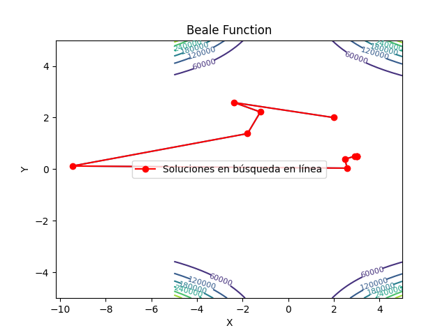
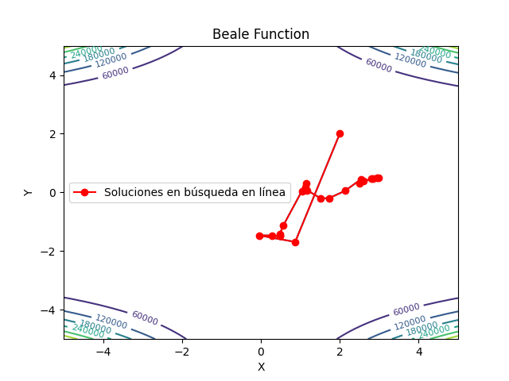

# Advanced Math for Data Science
## Escuela Superior de Cómputo - Instituto Politécnico Nacional

> Daniel Armas Ramírez
> 5AM1

1. Gradient Descent


2. Newton



3. Quasi-Newton




### Instrucciones

Clonar repositorio:

```bash
$ sudo apt install git
$ git clone https://github.com/daniel692a/nonlinear-programming.git
```

Crear entorno virtual

```bash
$ python3 -m venv env
$ source env/bin/activate
$ pip install -r requirements.txt
```